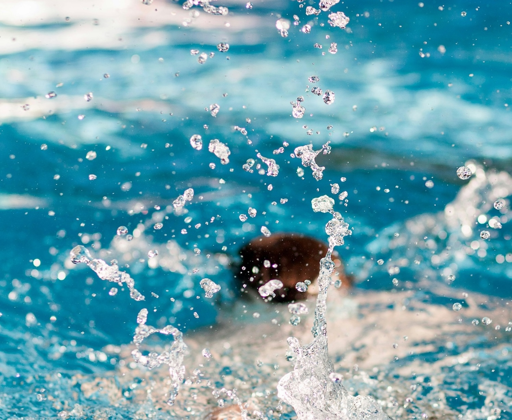
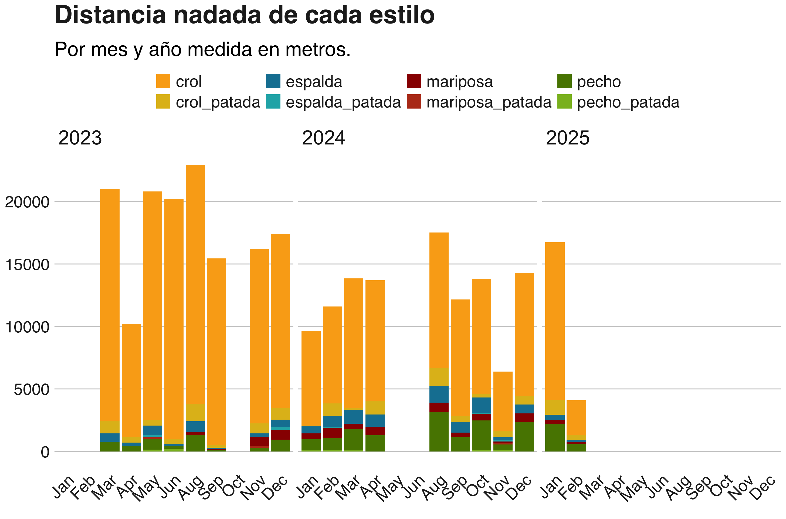
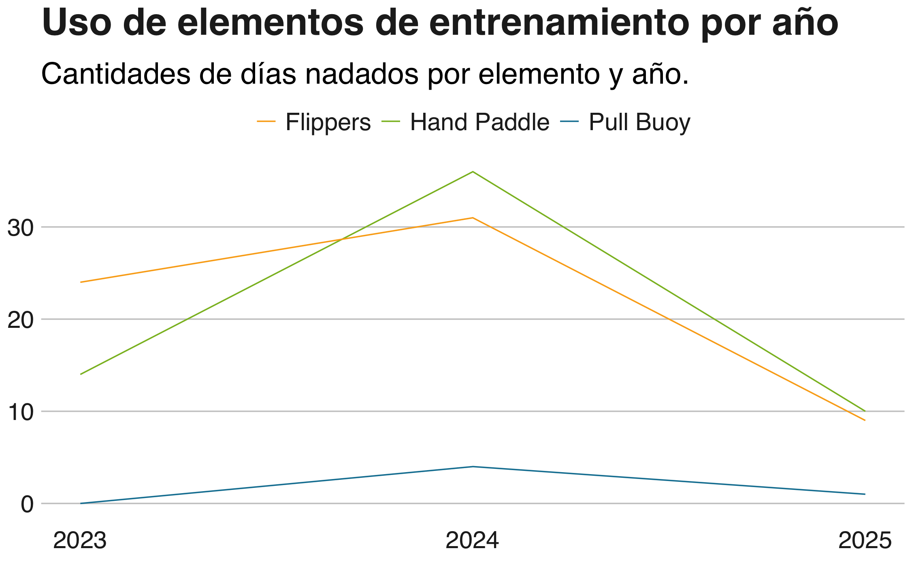

> Photo by <a href="https://unsplash.com/@laviperchik?utm_content=creditCopyText&utm_medium=referral&utm_source=unsplash">Lavi Perchik</a> on <a href="https://unsplash.com/photos/person-diving-on-pool-splashing-water-1qCSGzVEKKQ?utm_content=creditCopyText&utm_medium=referral&utm_source=unsplash">Unsplash</a>
      
      
Nadar es mi actividad fisica favorita.  Desde 2022 empece a nadar regularmente de nuevo con una profesora y un equipo de natacion.  En 2023 empece a publicar en mastodon con el hashtag #swimming mis rutinas y distancias y mas tarde ese mismo año decidí registrar estos datos en una planilla.  

La planilla tiene la siguiente estructura:

``` r
> str(data)
tibble [153 × 16] (S3: tbl_df/tbl/data.frame)
 $ fecha          : Date[1:153], format: "2023-03-02" "2023-03-03" "2023-03-07" ...
 $ crol           : num [1:153] 1650 1500 1700 1600 1500 1500 1800 1050 1800 1600 ...
 $ pecho          : num [1:153] 0 0 0 0 200 0 0 475 100 0 ...
 $ espalda        : num [1:153] 0 0 0 0 100 0 0 475 100 0 ...
 $ mariposa       : num [1:153] 0 0 0 0 0 0 0 0 0 0 ...
 $ crol_patada    : num [1:153] 0 0 0 200 200 200 200 0 200 0 ...
 $ pecho_patada   : num [1:153] 0 0 0 0 0 0 0 0 0 0 ...
 $ espalda_patada : num [1:153] 0 0 0 0 0 0 0 0 0 0 ...
 $ mariposa_patada: num [1:153] 0 0 0 0 0 0 0 0 0 0 ...
 $ total          : num [1:153] 1650 1500 1700 1800 2000 1700 2000 2000 2200 1600 ...
 $ hand_paddle    : num [1:153] 0 0 0 0 0 0 0 0 0 0 ...
 $ flippers       : num [1:153] 0 0 0 0 0 0 0 0 0 0 ...
 $ pull_buoy      : num [1:153] 0 0 0 0 0 0 0 0 0 0 ...
 $ notes          : chr [1:153] NA NA NA NA ...

 ```
 La fecha correpsonde al dia que fui a nadar. Luego tengo las distancias en metros que nade en cada estilo (crol, pecho, espalda y mariposa).  En algunas ocasiones hago patada con tabla, y en otras uso accesorios como patas de rana (flippers), manoplas (hand paddle) o pull buoy.  En la columna de notas a veces escribo algo que quiero recordar de esa clase, como por ejemplo el día que nade mariposa por primera vez o cuando mi madre empezo a nadar conmigo.
 
## Reconstruyendo datos

Como la planilla la inicie ya iniciado el 2023 me faltaban datos.  Asi que empece a buscar en mis publicaciones de mastodon utilizando el paquete {rtoot}.

``` r

library(rtoot)
library(dplyr)
library(lubridate)

# Busco mis publicaciones de una fecha determinada

post <- get_account_statuses("ID de usuario", max_id = as.POSIXct("2022-12-01"), limit = 1000)

# Convierto los datos en un tibble
post <- tibble::as_tibble(post)

# Filtro mis publicaciones con el hashtag #swimming

post_filtrados <- post |>
  select(uri, created_at, content) |>
  filter(str_detect(content, "swimming"))

```

Tuve que hacer varias busquedas para encontrar todas las publicaciones que hice sobre natacion. La variable `content` tiene el texto del post y me permitia filtrar las publicaciones relacionadas a natacion. Luego de un rato de trabajo, logre tener una planilla con todos los datos disponibles. No pude recuperar información del 2022.

## Visualizando mis datos

### Distancia por estilo

El primer gráfico interesante es uno que presente las distancias recorridas con cada estilo. Probe con un gráfico de lineas + puntos con los datos diarios, pero era complejo de leer.  Asi que pense en un gráfico de barras apiladas por estilo con totales mensuales.  

Primero realizo el calculo total de distancia por mes y año de cada estilo, incluyendo cuando hago solo patada de un estilo.

``` r

library(tidyverse)

# Calcular el total de distancia por mes y año por estilo incluyendo patadas

distancia_estilo <- data %>%
  group_by(Año, Mes) %>%
  summarise(across(c(crol, pecho, espalda, mariposa, crol_patada, pecho_patada, espalda_patada, mariposa_patada), sum, .names = "Total_{.col}")) %>%
  pivot_longer(cols = starts_with("Total"), 
               names_to = "Estilo", 
               values_to = "Distancia",
               names_prefix = "Total_")

```

Ahora hago el gráfico de barras apiladas. 
Me gusta mucho el estilo de la bbc para los gráficos, por eso lo utilizo en esta visualizacion (`bbc_style()` del paquete `bbplot`).  
Ademas, utilizo una paleta de colores manual (`scale_fill_manual()`) donde cada estilo tiene un color distinto y la patada tiene otro color en la misma gama que el estilo al que corresponde.
Finalmente lo divido por cada Año (`facet_wrap(~ Año)`)

``` r
library(ggplot2)
library(bbplot)

ggplot(distancia_estilo, aes(x = Mes, y = Distancia, fill = Estilo)) +
  geom_col(position = "stack") +
  scale_fill_manual(values = c("#FAAB18", "#e0bc1d", "#1380A1", "#1fb0b5", "#990000", "#b83b1c","#588300","#8aba27")) + 
  facet_wrap(~ Año) +
  labs(title = "Distancia nadada de cada estilo",
       subtitle = "Por mes y año medida en metros.",
       fill = "Estilo") +
  bbc_style() +
  theme(axis.text.x = element_text(angle = 45, hjust = 1))

```

Y este es el gráfico resultante:



Como se puede ver en el gráfico, la cantidad de metros nadados en crol es mucho mayor que en los otros estilos.  **El 29 de Agosto de 2023 aprendi a nadar mariposa!**.

### Elementos utilizados en los entrenamientos

Tambien es interante conocer que tipo de elementos utilizo durante los entrenamientos. Para eso hago un gráfico de barras con la cantidad de veces que utilice cada accesorio.  Primero realizo los calculos de dias totales por cada elemento:

``` r
uso_herramientas <- data %>%
  group_by(Año) %>%
  summarise(across(c(hand_paddle, flippers, pull_buoy), sum, .names = "Total_{.col}")) 

```

Y ahora realizo un gráfico de lineas:

``` r
ggplot(uso_herramientas) +
  geom_line(aes(x = Año, y = Total_hand_paddle, color = "Hand Paddle")) +
  geom_line(aes(x = Año, y = Total_flippers, color = "Flippers")) +
  geom_line(aes(x = Año, y = Total_pull_buoy, color = "Pull Buoy")) +
  scale_color_manual(values = c("#FAAB18", "#8aba27", "#1380A1")) +
  scale_x_continuous(breaks = seq(min(uso_herramientas$Año), max(uso_herramientas$Año), by = 1)) +
  labs(title = "Uso de elementos de entrenamiento por año",
       subtitle = "Cantidades de días nadados por elemento y año.") +
  bbc_style()
  
```  



En el gráfico podemos ver que el elemento que mas uso son las manoplas (que no me gustan), seguido por las patas de ranas (que si me gustan mucho).

### Datos de resumen 

Ahora me gustaria ver algunos otros datos de resumen como la cantidad de dias nadados en cada año, la cantidad de metros nadados en total y el promedio de metros nadados por clase. Esta vez elijo una tabla como medio de visualizar la información.


``` r
totales_anuales <- data %>%
  group_by(Año) %>%
  summarise(Distancia_Total = sum(total),
            Dias_Nadados = n_distinct(fecha),
            promedio_diario = mean(total))
```            

|Año|Distancia Total (m)|Dias Nadados|Promedio Diario (m)|
|---|---|---|---|
|2023|144200|77|1873|
|2024|112875|62|1820|
|2025|20850 |11|1895|

El promedio de metros en una hora no varia demasiado entre cada año. Aunque si nade mas en 2023 que en 2024.  Veremos como termina 2025. 

## Conclusiones

Siempre es interesante trabajar con mis propios datos.  
Me permitio recordar momentos importantes de mis entrenamientos y ver como evolucione en estos años. El objetivo de este 2025 es mejorar mis estilos y mi velocidad para ver si puedo incrementar la cantida de metros que puedo hacer en una hora. 
Tambien espero poder compartir competencias con mi equipo. Aunque no soy muy competitiva con la natación, me gusta la idea de nadar en grupo. 
