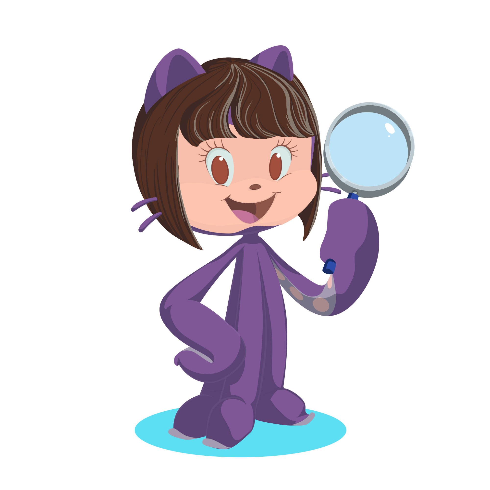

I will start a series of Linkedtorials. Over the next few days, I'll be sharing a series of short tutorials on GitHub for researchers who don't need to know how to program. Let me know what you think 😀.

## 🧵 Linkedtorial 1 – Introduction to GitHub for Researchers

🚀 **What is GitHub and why should you care about it as a researcher?**
👉 It is a platform for organizing projects, saving versions of your work, and collaborating with others.
You don't need to know how to code to take advantage of it.

🗂️ **GitHub = Project library** Each project resides in a _repository_ (repo): a space where you store documents, data, analyses, presentations, and everything else.
✅ Think of it as your research folder in the cloud, but with superpowers.

⏳ **Version control:** Have you ever ended up with files named _“final_thesis_v3_latest.docx”_?
With GitHub, we can save every change made in the project history.
You can go back, compare, and never lose an important version again.

🤝 **Collaboration:** With GitHub, several people can work on the same repository without stepping on each other's toes.
Each contribution is recorded with authorship, date, and explanation.
Transparency and recognition for the team!

🔎 **Reproducibility:** Open science depends on other people being able to follow your path.
A well-organized repository documents processes, data, and results.
This way, your colleagues can replicate your work (and you can too, in the future!).

### 📌 What you will learn in this series of Linkedtorials:

- Create your profile on GitHub
- Open repositories and start the README
- Use Issues as a to-do list
- Organize tasks with boards
- Collaborate with Pull Requests
- Share your authorship and license your work

🙌 **Spoiler:** in the next skytorial, you'll open your profile and we'll start using it!

👉 _Question for you:_ Do you already use GitHub, or will this be your first time?