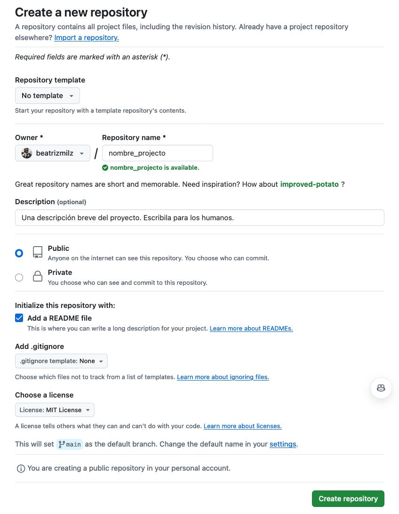
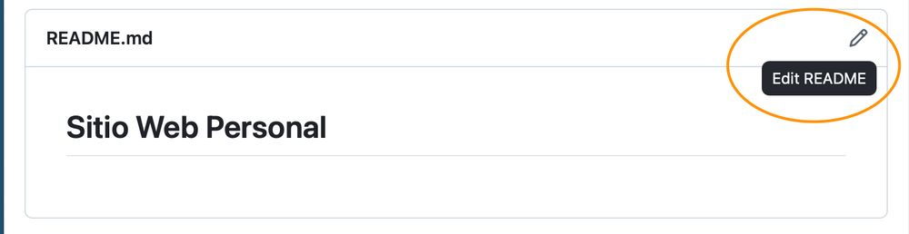
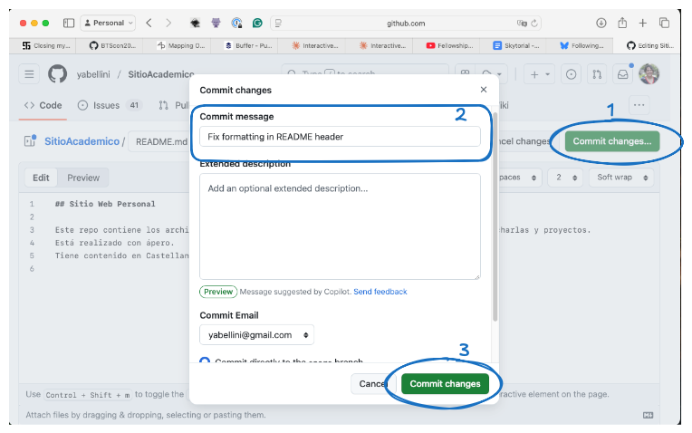

📂 On GitHub, every project lives in a repository (repo). A repo can contain:
- Documents
- Data
- Code (if any)
- Images
- Presentations
👉 Think of it as a folder in the cloud, but with a historical record of every change. 

### Let's create one👇
 
Create your first repo: On GitHub, click on ➕ (top right) → New repository

- Choose a short, descriptive name
- Add a description (which is the project)
- Choose visibility: public🔓 or private🔒
- Check the “Add a README file” option → highly recommended
- Click Create repository 🎉

### 📖 The README:

The README.md file is the cover page of your repo. It explains:

- What your project is about, you can include the objectives
- How to use or navigate it
- Contact information
- Authorship and funding information
To edit it, click on the pencil (top right) next to the file name.

### 📝 Commits: your change history

To apply the changes on your README, you will net to save those changes using a _commit_. A commit is like a “Save version” with comments.
Every time you edit or upload a file (such as the readme), you can:

- Add a message explaining what you did.
- Confirm (commit changes).
Examples of good commit messages:
✅ “Add initial sampling table”
❌ “Various changes”

### Important files for a repo

#### 📜 Add a License:
 
This is important because licenses tell others how they can use your work.
The LICENSE file contains the project license.

- [Tool for choosing a license](https://choosealicense.com/)
- [Explanation of legal jargon in simple terms](https://tldrlegal.com/)

#### 📄 Citations

With the license, you tell others how they can use your work with the CITATION.cff file, ou add BibTex formatting to indicate how the work in your repository should be cited. [La documentacion de GitHub explica cón mas detalles como estan compuestos y como usar los archivos de citas en tu repo](https://docs.github.com/en/repositories/managing-your-repositorys-settings-and-features/customizing-your-repository/about-citation-files).  

#### 💡 Code of Conduct and Contribution Guide:

For collaborative projects, add:

1.CODE_OF_CONDUCT: establishes rules of respect and coexistence. 
2.CONTRIBUTING: instructions for collaborating on your project.

GitHub offers ready-made templates for both 👉 https://docs.github.com/en/communities/setting-up-your-project-for-healthy-contributions/adding-a-code-of-conduct-to-your-project

### 📝 Upload files

Within your repository, click Add file → Upload files.

You can drag and drop:
📄 Documents
📊 Data
🖼️ Figures
📑 Notes
You can also use folders to organize your project:
📂 data/
📂 figures/
📂 documents/

This makes it easier for your collaborators to find information.

### That's it for linkedtorial 3 🎉.

Now you know how to:
✔️ Create a repo.
✔️ Write a README.
✔️ Add a license, CoC, contribution guide, and citation.
✔️ Upload and organize files.

👉 Next: **Issues to organize tasks as a TODO list!**