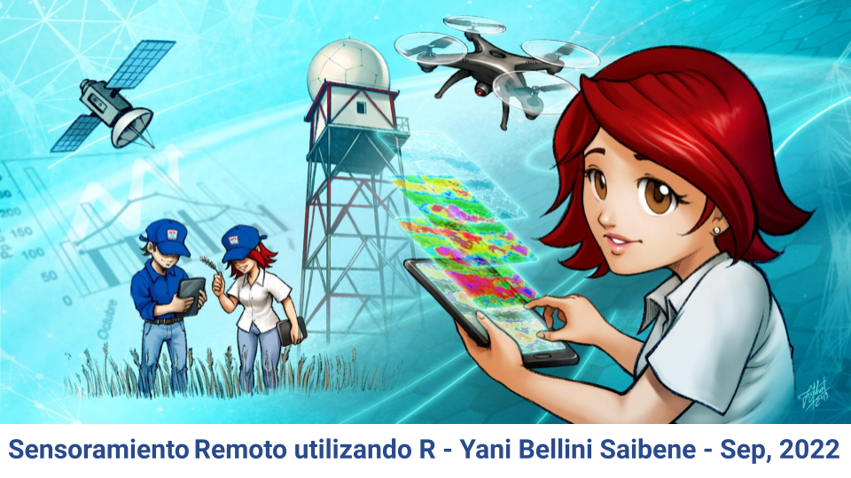

### ¿De qué se trata este curso?

Este curso está pensado para personas que ya tienen conocimientos de teledetección y usan Google Earth Engine (GEE) y quieren empezar a usarlo desde R. Tienen algo de experiencia utilizando R o algún otro lenguaje de programación pero buscan organizar mejor su trabajo y generar resultados e informes para compartir.

Proponemos trabajar con R de forma ordenada y reproducible. Por ello, presentamos un flujo de trabajo que permite a quienes realicen este curso aplicar buenas prácticas de programación, trabajar de forma colaborativa y presentar su trabajo en un único documento que incluya el análisis y los resultados.

Veremos conceptos básicos de datos espaciales, los paquetes disponibles en R para trabajar con este tipo de datos y nos enfocaremos en el paquete rgee para el uso de Google Earth Engine desde R.

En cada sección incluimos actividades junto con ejemplos. Queremos que estos ejercicios sean realistas para que cualquiera pueda encontrar similitudes en sus propios datos y pueda aplicar lo aprendido a otras situaciones
