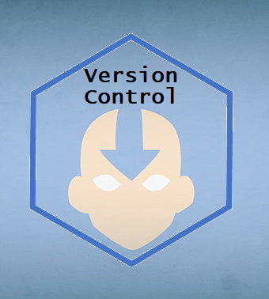

## ¿De qué se trata este curso?

En este post introducimos los primeros pasos para usar Git con RStudio title: Primeros pasos de Git con R.

## Contenido:

  * Qué es el control de versiones.
  * Qué es git, que diferencia tiene con GitHub.
  * Cuales son los estados de un archivo que tiene control de versiones.
  * Cuales son los comandos de git para cambiar esos estados.
  * Como tener control de versiones en un proyecto de RStudio.
  * Cómo aplico los comandos de git desde RStudio.

Los materiales presentan un video con el taller completo, incluyendo conceptos teóricos y práctica con código.

## Licencia

Creative Commons License.
Todo el material de este curso está bajo la licencia Creative Commons Attribution-ShareAlike 4.0 International License.

Puedes citar ester recurso como:

> Yanina Bellini Saibene, & Marysol Gatti. (2020, September). yabellini/Intro_to_Git_with_Rstudio: Primeros pasos de Git con R y RStudio (Version v1.0). Zenodo. http://doi.org/10.5281/zenodo.4012062
