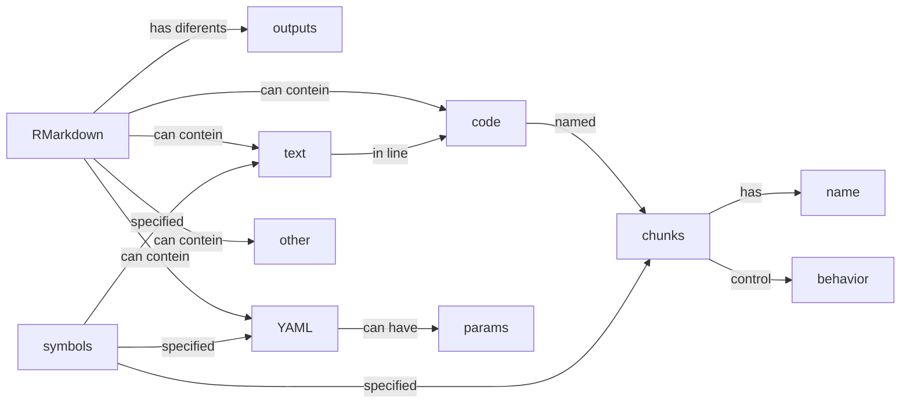
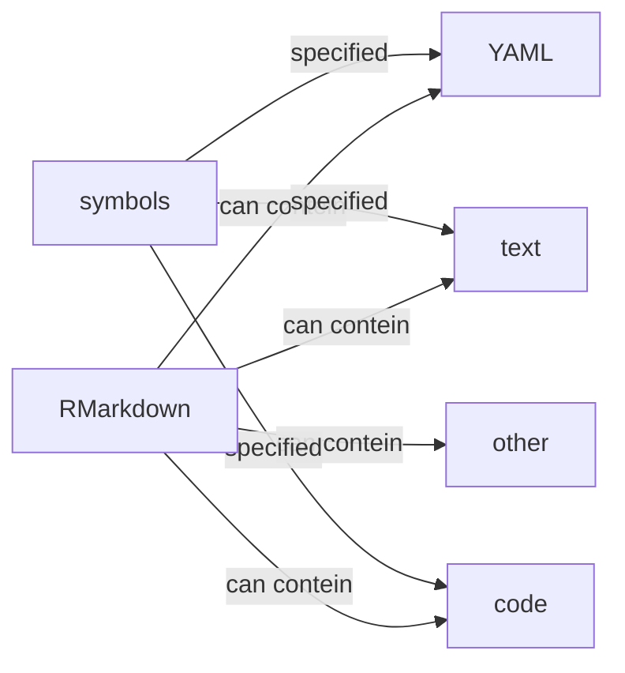
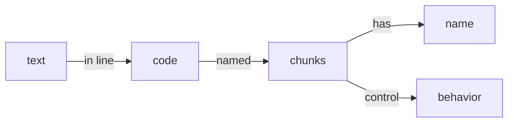
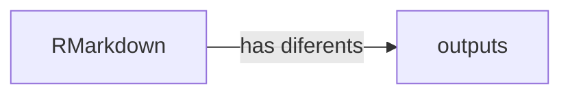
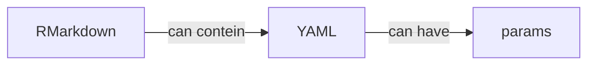

The [Concept Maps] (http://teachtogether.tech/#s:memory-concept-maps) describe the topics that the course will address and how they are connected to each other. They also organize the lessons into sets of concepts to be taught per lesson, taking into account the cognitive load and the rule of 7 + - 2 concepts per lesson. This information should help in the decision to use the materials, both to take the course, and to use them in order to generate their own.

## Concept Map - Full Workshop

## Concept Map - Lesson 1

## Concept Map - Lesson 2

## Concept Map - Lesson 3

## Concept Map - Lesson 4

