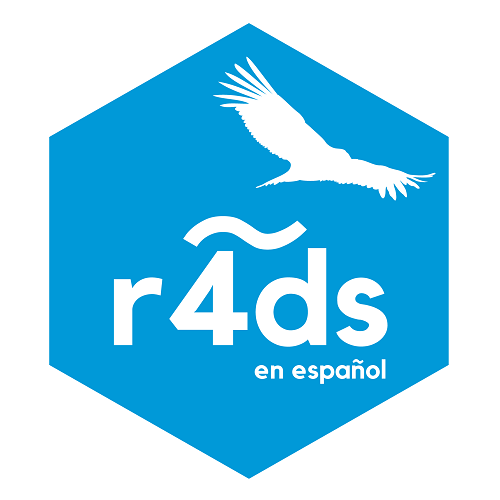

## Español

## R para Ciencia de Datos

Garrett Grolemund y Hadley Wickham

### Bienvenida

La traducción de “R para Ciencia de Datos” es un proyecto colaborativo de la comunidad de R de Latinoamérica, que tiene por objetivo hacer R más accesible en la región. Este proyecto realizó la traducción colaborativa al español de “R for Data Science”, de Hadley Wickham y Garrett Grolemund. Este texto te enseñará cómo hacer ciencia de datos con R: aprenderás a importar datos, llevarlos a la estructura más conveniente, transformarlos, visualizarlos y modelarlos. Así podrás poner en pŕactica las habilidades necesarias para hacer ciencia de datos. Tal como los químicos aprenden a limpiar tubos de ensayo y ordenar un laboratorio, aprenderás a limpiar datos y crear gráficos— junto a muchas otras habilidades que permiten que la ciencia de datos tenga lugar. En este libro encontrarás las mejores prácticas para desarrollar dichas tareas usando R. También aprenderás a usar la gramática de gráficos, programación letrada e investigación reproducible para ahorrar tiempo. Además, aprenderás a manejar recursos cognitivos para facilitar el hacer descubrimientos al momento de manipular, visualizar y explorar datos.
Sobre la traducción

En la traducción del libro participaron las siguientes personas (en orden alfabético): Marcela Alfaro, Mónica Alonso, Fernando Álvarez, Zulemma Bazurto, **Yanina Bellini Saibene**, Juliana Benítez, María Paula Caldas, Elio Campitelli, Florencia D’Andrea, Rocío Espada, Joshua Kunst, Patricia Loto, Pamela Matías, Lina Moreno, Paola Prieto, Riva Quiroga, Lucía Rodríguez, Mauricio “Pachá” Vargas, Daniela Vázquez, Melina Vidoni, Roxana N. Villafañe. ¡Muchas gracias por su trabajo! La administración del repositorio con la traducción ha estado cargo de Mauricio “Pachá” Vargas. La coordinación general y la edición, a cargo de Riva Quiroga.

Agradecemos a todas las personas que han ayudado revisando las traducciones y haciendo sugerencias de mejora. Puedes revisar la documentación del proyecto para ver los créditos de participación. Gracias también a Marcela Alfaro por el tuit que hizo visible la necesidad de la versión en español, y a Laura Ación y Edgar Ruiz, que pusieron en contacto a las personas del equipo.

Este proyecto no solo implica la traducción del texto, sino también de los sets de datos que se utilizan a lo largo de él. Para ello, se creó el paquete datos, que contiene las versiones traducidas de estos. Puedes revisar su documentación acá. El paquete fue desarrollado por Edgar Ruiz, Riva Quiroga, Mauricio “Pachá” Vargas y Mauro Lepore. Para su creación se utilizaron funciones del paquete datalang de Edgar Ruiz y las sabias sugerencias de Hadley Wickham.

Si quieres conocer más sobre los principios que han orientado nuestro trabajo puedes leer [la documentación del proyecto](https://github.com/cienciadedatos/documentacion-traduccion-r4ds). Para estar al tanto de novedades sobre el paquete {datos} y nuevas iniciativas del equipo, sigue nuestra cuenta en Twitter.

## English

## R for Data Science in Spanish

We are a group of R users who want R to be more accessible in Latin America. For this reason, we translated R for Data Science (R4DS), developed the package {datos} and helped in the translation of the package {dados} in Portuguese. We also organized #DatosDeMiercoles  (Latin American cousin of Tidy Tuesday) and #30díasdegraficos.

### My role in this project

I have been a translator of the book R for Data Science and a contributor and participant to  #DatosDeMiercoles And 30 Days of Graphics.

### Collaborative translation project of "R for Data Science."

This project aims to develop a collaborative translation of the book [R for Data Science](http://r4ds.had.co.nz/) for the Spanish-speaking community. The Spanish version can be accessed [here](http://es.r4ds.hadley.nz).

### Code of conduct

The R4DS translation project is an open space that aims to generate resources for the Spanish-speaking community through collaborative work dynamics. Therefore, during the translation and revision process, it is expected that people can participate freely, sharing ideas, making suggestions, proposing changes, analyzing points of view, etc., in an atmosphere of respect and collaboration. Likewise, those who participate are expected to make fair, constructive, and purposeful criticism, not value judgments.
At all times, it will be ensured that this is an environment free from harassment and harassment, regardless of sex, identity, gender, age, sexual orientation, disability, physical appearance, body size, race, ethnicity, religion (or the lack of it), ideology, nationality, linguistic variant or technological options. Harassment or harassment in any form will not be tolerated. Those who engage in this type of conduct will be permanently marginalized from the work process. Sexual language and images of this type are not appropriate in any space in this project.

### Work materials

In the repository, you will find the materials with the guidelines for the translation and revision process:

* The file [guidelines for translation](https://github.com/cienciadedatos/documentacion-traduccion-r4ds/blob/master/orientaciones-traduccion.md) describes the aspects to take into account when translating the text and code used in each chapter.
* The file [workflow](https://github.com/cienciadedatos/documentacion-traduccion-r4ds/blob/master/flujo-trabajo.md) indicates the sequence of actions throughout the translation and revision process chapters.
* In the file [guidelines for the review](https://github.com/cienciadedatos/documentacion-traduccion-r4ds/blob/master/orientaciones-revision.md), recommendations are provided on the aspects in which it is necessary to look at the time to review a translation and the type of language to use to make recommendations.
* In the file [credits and participation](https://github.com/cienciadedatos/documentacion-traduccion-r4ds/blob/master/creditos-participacion.md) the responsibilities of the people participating in this project and the Chapter assignment for translation and revision. The contributions made by the community through Github are also recorded.
* In the file [progress status](https://github.com/cienciadedatos/documentacion-traduccion-r4ds/blob/master/estado-avance.md), it is indicated in which phase of the process each one of the chapters goes.

### How to contribute?

This project is open to the community in which everyone can participate as long as they __adcribe our code of conduct__. If you are interested in joining the team, review the documents in this repository to determine how we are organizing the work and then contact us through [_issue_](https://github.com/cienciadedatos/documentacion-traduccion-r4ds/issues/1 ) that we have opened for that purpose.
