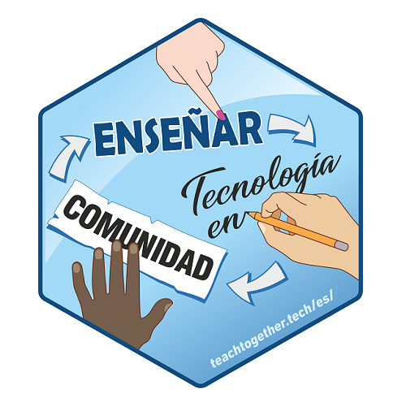

# English

## Teaching Tech Together in Spanish
### Collaborative and voluntary translation project of "Teaching Tech Together" to Spanish

_Teaching Tech Together_ is a book about teaching programming for people with technical training but without formal training as educators. This project aims to develop a collaborative translation of the book [Teaching Tech Together](http://teachtogether.tech/en/index.html) by [Greg Wilson](https://third-bit.com/) for the Spanish-speaking community. The Spanish version can be accessed [here](http://teachtogether.tech/es/index.html).

### Translations guidelines

In the [project repository](https://github.com/gvwilson/teachtogether.tech) there are detailed the process and aspects to take into account when translating the text, the exercises, references to external materials, diagrams and glossary. The progress status of the project and the responsibilities of the people involved are also made explicit there.

### How to contribute?

This is a project open to the community in which everyone can participate as long as they __adscribe our [code of conduct](http://teachtogether.tech/en/index.html#s:conduct)__.

# Español

## Enseñar Tecnología en Comunidad. 

### Cómo crear lecciones que funcionen y construir una comunidad docente alrededor  

Este proyecto llevó acabo la traducción al castellano del libro [Teaching Tech Together](http://teachtogether.tech) escrito por [Greg Wilson](https://third-bit.com). Este proyecto voluntario y colaborativo tiene tiene por objetivo traducir al español material actualizado 
y de calidad para hacerlo accesible a hispanohablantes.

Iniciamos el proceso de traducción en _marzo del año 2020_ y lo completamos en _marzo del 2021_.

El trabajo se organizó de manera que cada capítulo tuvo una persona asignada a cargo de la traducción y dos personas que realizaron las revisiones correspondientes.  
Se buscó que el idioma de las traductoras y revisoras tuviera origen en diferentes países para poder considerar las diferentes y hermosas formas en que hablamos español en todo el mundo.
Al finalizar todo el proceso se realizó una edición final del libro en su conjunto.

Las decisiones que tomamos durante el proceso de traducción se basaron en experiencias previas del equipo y en otras guías de traducciones colaborativas al español como [R para Ciencia de Datos](https://github.com/cienciadedatos/documentacion-traduccion-r4ds) y [The Carpentries](https://github.com/Carpentries-ES/board/blob/master/Convenciones\_Traduccion.md).

La variedad dialéctica del español (castellano) utilizada en la traducción corresponde  a Latinoamérica y se utilizó una voz conversacional en lugar de una voz formal o académica.

Decidimos intentar ajustar la redacción para evitar la marca de género, pero
en caso de no poder evitar su uso, decidimos utilizar lenguaje no sexista  
que implica el uso del femenino y masculino privilegiando la agilidad y fluidez del texto, que el mismo se entienda y que sea claro el mensaje. Para que haya coherencia a lo largo del texto y mostrar que no hay una determinada jerarquía 
alternamos el uso del femenino/masculino o masculino/femenino entre capítulos 
y el uso fue consistente durante todo el capítulo. 

También decidimos buscar las versiones al español de referencias como 
entradas en _Wikipedia_ y lecciones de _The Carpentries_.  En caso que no existieran se dejaron las versiones en inglés.

Finalmente, se decidió cambiar algunos ejemplos a realidades más regionales, 
para que sean más cercanos a la región de origen de la mayoría de las
traductoras.

Quienes trabajamos en este proyecto somos (en orden alfabético):
[Laura Acion](https://twitter.com/\_lacion\_),
[Mónica Alonso](https://twitter.com/MonicaLA2000),
[Zulemma Bazurto](https://twitter.com/Zjbb),
[Alejandra Bellini](https://twitter.com/AlejaBellini),
__[Yanina Bellini Saibene](https://twitter.com/yabellini),__
[Juliana Benitez Saldivar](https://twitter.com/July\_Benitezs),
[Lupe Canaviri Maydana](https://twitter.com/luucamay\_),
[Silvia Canelón](https://twitter.com/spcanelon),
[Ruth Chirinos](https://twitter.com/ruthy\_root),
[Paola Corrales](https://twitter.com/PaobCorrales),
[María Dermit](https://twitter.com/DermitMaria),
[Ana Laura Diedrich](https://twitter.com/anadiedrichs),
[Patricia Loto](https://twitter.com/patriloto),
[Priscilla Minotti](https://twitter.com/pmnatural),
[Natalia Morandeira](https://twitter.com/Nat\_Mora\_),
[Lucía Rodríguez Planes](https://twitter.com/\_luciarp\_),
[Paloma Rojas](https://twitter.com/palolili23),
[Yuriko Sosa](https://twitter.com/YkSosaP)
[Natalie Stroud](https://www.linkedin.com/in/natalie-stroud-63110a113/),
[Yara Terrazas-Carafa](https://twitter.com/\_yarena) y
[Roxana Noelía Villafañe](https://twitter.com/data\_datum).

En cada capítulo encontrarás el detalle de las personas que estuvieron a cargo de traducirlo y revisarlo.

La coordinación del trabajo estuvo a cargo de __Yanina Bellini Saibene__ y la edición final a cargo de __Yanina Bellini Saibene y Natalia Morandeira__.

[Malena Zabalegui](https://www.instagram.com/malenazabalegui/) nos aconsejó sobre el uso de lenguaje no sexista e inclusivo para la realización de esta traducción y [Francisco Etchart](https://www.instagram.com/fetch.franciscoetchart/) diseñó el hex sticker.

También generamos un [glosario y diccionario bilingüe de términos de educación y tecnología](https://yabellini.shinyapps.io/T3Glossary/) a partir del glosario del libro y del listado de términos a traducir (o no) del libro.
El desarrollo de este glosario estuvo a cargo de __Yanina Bellini Saibene__ utilizando [glosario](https://carpentries.github.io/glosario/).

Todos los detalles del proceso de traducción se pueden consultar
[en la documentación del proyecto](https://github.com/gvwilson/teachtogether.tech/blob/master/es/README.md).

> Marzo de 2020 – Marzo de 2021. Traducción colaborativa al castellano del libro “Teaching Tech Together. How to create and deliver lessons that work and build a teaching community around them” de Greg Wilson (2019, Taylor & Francis, ISBN 978-0-367-35328-5, <https://teachtogether.tech/>). Coordinación general de la traducción: Yanina Bellini Saibene; Edición general: Yanina Bellini Saibene y Natalia Morandeira. Más información y grupo de traductoras: https://github.com/gvwilson/teachtogether.tech/blob/master/es/README.md
