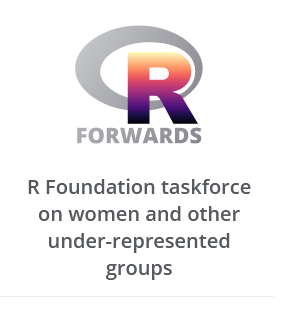

## English

The task force was set up by the R Foundation in December 2015 to address the underrepresentation of women and rebranded in January 2017 to accommodate more under-represented groups such as LGBT, minority ethnic groups, and people with disabilities in the R community.

The members of the task force were invited to participate based on their interest in routing for specific under-represented groups and their contributions in the area of diversity and inclusion, to reflect different genders, ethnic groups, work contexts, career stages and aspects of the R project (e.g. CRAN and Bioconductor). The task force is organised as a core team plus a number of sub-teams that focus on particular tasks.

### My role at Forwards

I lead the Conferences Team and I'm part of the Forwards Core Team. The [conference Team](https://forwards.github.io/conferences.html) focus on R Foundation conferences, liaising with organizers/program committee on policies and inclusion initiatives.

The [useR! knowledge base project](https://rconf.gitlab.io/userknowledgebase/main/index.html) and the useR! working group are part of the task I have in this role.

Updates on RForwards activities on the R Journal:

* [News from the Forwards Taskforce - 2021](https://journal.r-project.org/news/RJ-2021-2-forwards-news/)
* [News from the Forwards Taskforce - 2022-2](https://journal.r-project.org/news/RJ-2022-2-forwards/)
* [News from the Forwards Taskforce - 2022-4](https://journal.r-project.org/news/RJ-2022-4-forwards/)
