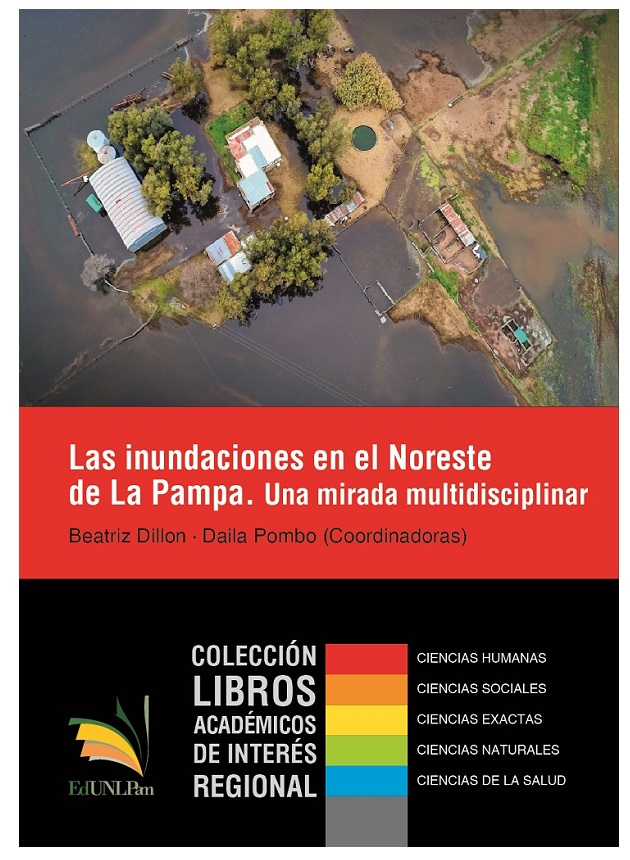

Las inundaciones son eventos extremadamente complejos y su ocurrencia es el resultado de una compleja red de convergencias que coadyuvan en su ocurrencia. La acción combinada de factores de índole sociocultural, económicos, políticos, ideológicos, tecnológicos y naturales confluye en la construcción de espacios geográficos de riesgo. Las inundaciones en el Noreste de La Pampa y más ampliamente en la denominada pampa deprimida argentina son históricamente recurrentes aunque en los últimos 40 años se han visto agravadas por esta variedad de causas.

Las inundaciones y sus impactos se originan en la dinámica del modo de producción capitalista y en la organización para la gestión de la prevención y/o mitigación. Sin embargo, desde el discurso oficial se remite, frecuentemente, al aumento de las precipitaciones, a la hora de responsabilizar la culpabilidad por los daños ocasionados en ambientes urbanos y rurales. Una manera simple y sencilla de desplazar el centro del problema hacia un responsable “abstracto”, un enemigo etéreo, sobre el cual “no se puede hacer nada” y solo “hay que esperar que pase”.

Este libro es el resultado de investigaciones realizadas por un equipo interdisciplinario integrado por docentes e investigadores del Instituto de Geografía de la Facultad de Ciencias Humanas de la Universidad Nacional de La Pampa y por técnicos, investigadores y extensionistas del Instituto Nacional de Tecnología Agropecuaria - Estación Experimental Anguil “Guillermo Covas” de la provincia a de La Pampa (INTA-EEA).

Podes [Comprar el Libro](http://www.unlpam.edu.ar/cultura-y-extension/edunlpam/catalogo/libros-de-interes-regional/las-inundaciones-en-el-noreste-de-la-pampa) o descargarlo de forma gratuita.

> Categoría: Libros Académicos de Interés Regional, ISBN: 978-950-863-355-2
Autor/es: Coordinadoras: Beatriz Dillon (coordinadora) / Daila Pombo (coordinadora) / *Yanina Bellini Saibene* / María Laura Belmonte / Juan Pablo Bossa / María Carolina Diharce / Beatriz Dillon / Danilo Leone Escuredo / Julio César Fernández / María Elena Fuentes / José María Galea / Natalia Gattinoni / Alejandro Godoy / Micaela Anahí Herlein / María Celeste Martínez Uncal / Leandro Palazzo / Daila Pombo
