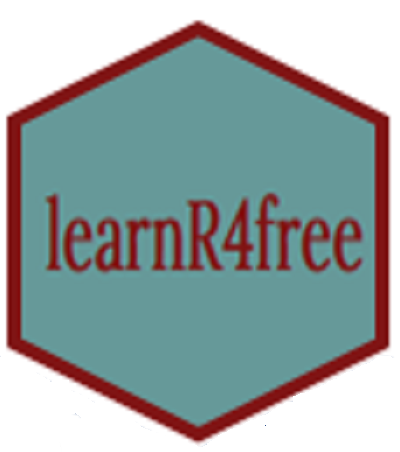

## English

In this website you can find all sorts of resources (books, videos, interactive websites, papers) to learn R. Some of the resources are beginner-friendly and start with the installation process. 

### What does free in learnR4free mean?

Free in this case means that the monetary cost for the learner is zero. There are some resources that ask for donations, and there are some resources that provide some of the material or learning opportunities for free and for the rest they charge. On this website, I only list resources that are fully free. In other words, any learner who pays and who does not pay have access to the same materials and opportunities. 

### Can I submit a resource?

The resource has to be free as further defined above. It should not be time sensitive, as in, there is this workshop that will take place on Thursday. The main reason is that I do not have the time to update the website often so resources that are (sort of) permanent are preferred. There are some amazing package documentations out there as vignettes. However, they will not be listed here mainly because there are many of them.

If the resource meets these criteria then please submit the resource by filling ou [this form](https://docs.google.com/forms/d/e/1FAIpQLScGztO2ys0GNxQk03P4N-FAGJ5kVJitIA7BqJ0bMJ1f4LDvug/viewform).

### I have submitted a resource but it is not listed. Why?

There may be many reasons. I might be busy with work and may not have the time to update the website. The resource may not be fully free (see definition above). It may not be suitable for one reason or the other. I will try my best to communicate with you. 

## Español

En este sitio web puedes encontrar todo tipo de recursos (libros, videos, sitios web interactivos, artículos) para aprender R. Algunos de los recursos son para principiantes y comienzan desde el proceso de instalación de R. Si quieres que agreguemos un recurso completa el formulario.

### ¿Qué significa "free" (gratuito) en learnR4free?

Free (es decir, gratuito) en este caso significa que el costo monetario para quienes usen los materiales es cero. Hay algunos recursos que piden donaciones y otros que proporcionan una parte del material u oportunidades de aprendizaje de forma gratuita y para el resto cobran. En este sitio web, solo enumeramos recursos que son totalmente gratuitos. En otras palabras, cualquier persona (pague o no) tiene acceso al mismo material y a las mismas oportunidades.

### ¿Puedo enviar cualquier recurso?

¡No! El recurso tiene que ser gratuito, como se define más arriba. No debe ser sensible al tiempo, como por ejemplo: "Un taller que tendrá lugar este jueves". La razón principal es que no tenemos tiempo para actualizar el sitio web a menudo, por lo que se prefieren los recursos que son (más o menos) permanentes. Hay algunas documentaciones increíbles sobre paquetes en forma de viñetas. Sin embargo, no se enumerarán aquí principalmente porque hay muchas. 

### Envié un recurso pero no está en la lista. ¿Por qué?

Puede haber muchas razones. Podríamos estar ocupadas con el trabajo y no tener tiempo para actualizar el sitio web. Es posible que el recurso no sea totalmente gratuito (consulta la definición anterior). Puede no ser adecuado por una razón u otra. Haremos todo lo posible para comunicarnos contigo. 
