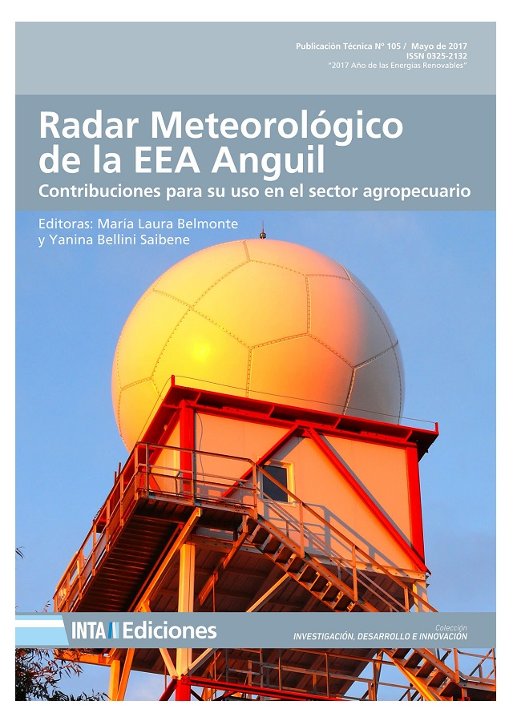

### Editoras: María Laura Belmonte, Yanina Bellini Saibene  

Esta publicación tiene como objetivo compilar los trabajos de investigación y desarrollo llevados adelante en la Estación Experimental Anguil utilizando como herramienta principal el radar meteorológico situado en sus instalaciones, desde el 2009 al 2017.

La instalación durante el año 2009 del radar meteorológico en la Estación Experimental del INTA ubicado en Anguil, que sumado a otros dos radares situados en Paraná, Entre Ríos y Pergamino, Buenos Aires, permitió la integración de una red que cubre una parte significativa de la Región Pampeana Argentina.

Los efectos directos de la operación de los radares están relacionados con el funcionamiento y respuesta de organismos del sector público, cuya mejora redunda en forma indirecta en beneficio de productores agropecuarios y empresas de servicios del sector, como la mejora en la capacidad de pronóstico de corto plazo y diagnóstico del tiempo en cuanto a la previsión de lluvias y el aumento de la capacidad de generar alertas tempranas de tormentas severas por parte de los organismos competentes.

El INTA se halla actualmente en una etapa de validación y verificación de las estimaciones obtenidas por los productos que generan los radares, las que deben ser contrastadas con datos de campo pluviométricos, y además con mediciones de disdrómetros e impactómetros. Los resultados de la validación deben ingresar en un sistema de ajuste de los parámetros y coeficientes usados para las estimaciones de precipitación y probabilidad de granizo.

Los esfuerzos de investigación y desarrollo están orientados a generar productos en forma operacional con el objeto de poner a disposición del público en general y de tomadores de decisiones, públicos o privados, varios niveles de información como: mapas de distribución espacial de precipitación instantánea e integrada en períodos arbitrarios a fin de realizar estimaciones de balance hídrico edáfico y evaluación de la condición de los cultivos; volumen de agua total precipitado en cuencas o subcuencas, como dato de entrada para modelos hidrológicos; mapas de ocurrencia de granizo, e indicadores de daño potencial; definición de las condiciones que determinan situaciones de riesgo, y generación automática de mensajes de alerta para las autoridades competentes. Como así también consolidar una base de datos históricos que asegure la disponibilidad de los mismos para futuras actividades de investigación.

> Publicación Técnica Nº 105, ISSN: 0325-2132, Fecha de publicación: Mayo de 2017, Editorial: Ediciones INTA
