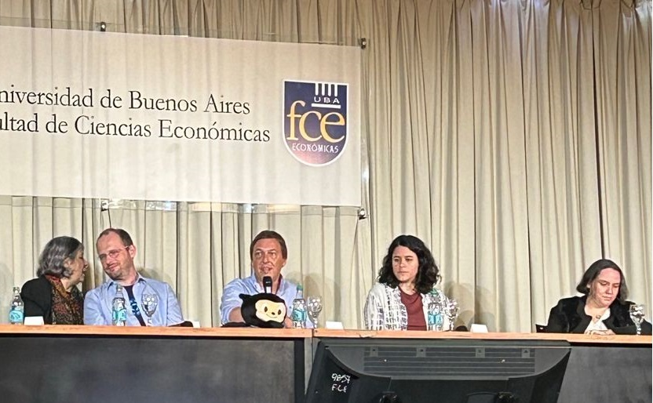
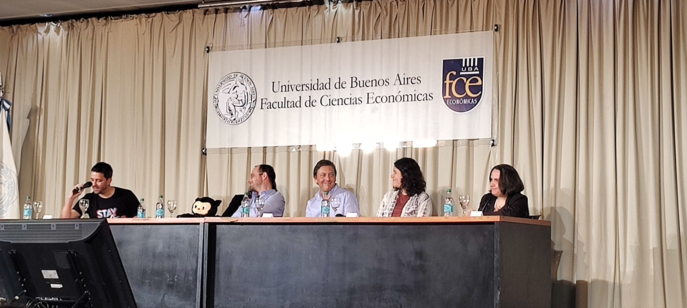

Evento organizado por Microsoft Argentina en la Facultad de Ciencias Económicas de la UBA en el que Thomas Dohmke CEO de GitHub habló sobre Github Copilot.

Tambien hubo un panel de preguntas sobre IA protagonizado por Fernando Lopez Iervasi, gerente general de Microsoft Argentina, Lucia Brizuela, Sr tech director en Cloud & Platform de Mercado Libre y Yanina Bellini Saibene como Github Star, con Martin Sciarrillo, CTO de Microsoft Argentina, como host del panel.

